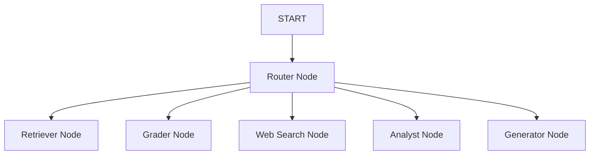

# Multi-Agentic CRAG (Corrective RAG)

Overview
--------
Multi-Agentic CRAG is a Python application implementing a corrective retrieval-augmented generation (cRAG) architecture. It composes specialized agents (Router, Retriever, Grader, Web Search, Data Analyst, Generator) orchestrated by langgraph to answer user queries using local FAISS indices with a Tavily web-search fallback.

Key features
- Local document ingestion (.pdf, .docx, .txt) with chunking (RecursiveCharacterTextSplitter: chunk_size=1000, overlap=200).
- FAISS vector store persistence (index.faiss and index.pkl) under data/vector_dbs/<index_name>.
- Grader agent to validate retrieved chunks and trigger Tavily fallback when relevance is low.
- Data Analyst agent that detects simple tabular/numeric outputs and returns Plotly-compatible JSON for visualization.
- Streamlit UI for chat-like interactions, index management, and visualization.

## Flow Diagram

The following Mermaid diagram outlines the flow of execution within the app's graph:

## Features

- **Router Agent**: Routes queries to the appropriate downstream agent.
- **Retriever Agent**: Fetches relevant information for the query.
- **Grader Agent**: Grades content chunks or retrieved data based on quality.
- **WebSearch Agent**: Performs web searches to gather more data.
- **Analyst Agent**: Processes data to generate insights or plots.
- *rmaidsizing responses for user queries.

Security / API keys
-------------------
Store your API keys in a .env file in the project root or in the parent "Vibe Coding" folder (they are loaded via python-dotenv). Do NOT commit your .env to git. The repository includes a .env.example showing required variables:

- OPENAI_API_KEY
- TAVILY_API_KEY

The app reads environment variables at runtime. The Streamlit sidebar exposes masked fields so you can quickly set keys when running locally without placing them in source.

Quick start
-----------
1. Create and activate a virtualenv and install dependencies:

   python -m venv .venv
   .venv\Scripts\activate  (Windows) or source .venv/bin/activate (macOS/Linux)
   pip install -r multi_agentic_crag/requirements.txt

2. Create a .env (or copy .env.example) and set your OPENAI_API_KEY and TAVILY_API_KEY.

3. Run the Streamlit app:

   streamlit run multi_agentic_crag/src/app.py

Logs
----
The application writes logs to multi_agentic_crag/logs/app.log (rotating). Use this file to inspect execution details and debug issues. The logging configuration will also respect the console output.

## Future Improvements

- Add more advanced error handling within agents to handle edge cases.
- Incorporate a distributed graph execution engine for scalability.
- Extend agents to support more diverse use cases.
- Optimize performance by introducing caching mechanisms.
- Include logging and monitoring extensions for critical metrics.

Project layout
--------------
- multi_agentic_crag/
  - src/
    - agents/         # router, retriever, grader, web_search, analyst, generator
    - utils/          # document loaders
    - graph.py        # langgraph workflow and state definition
    - app.py          # Streamlit entry point
    - vector_store.py # FAISS helpers
    - logging_config.py # logging setup (file + console)
  - data/             # persistent FAISS indices (created at runtime)
  - tests/            # unit tests (pytest)
  - requirements.txt
  - .env.example

Notes and next steps
--------------------
- The current grader is a heuristic placeholder; replace with an LLM-based grader for production.
- Improve streaming generation with LangChain/OpenAI streaming support to provide chat-like incremental responses.
- Extend tests to mock OpenAI and Tavily for full coverage and CI.

Contact
-------
This scaffold was created by Cline — a development assistant. For issues, review logs under multi_agentic_crag/logs/app.log after running the app.